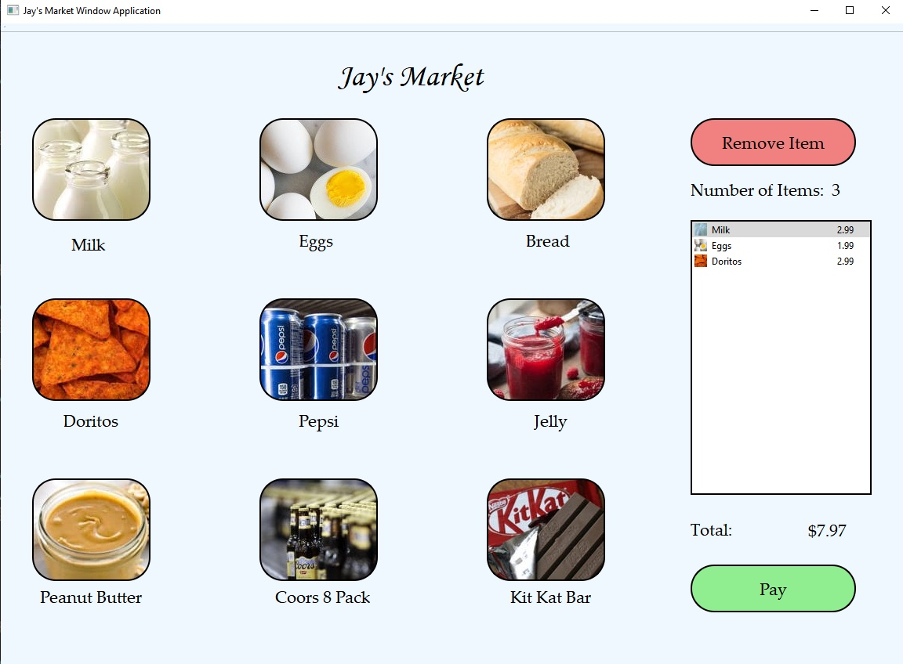

# Grocery Store Window QtApplication

I created a windows application of a store where a customer could go online to buy groceries. The user is able to click on any of the picture and add it to the list on the right hand side. 
It displays the total number of items, the name and price of the item and the total price of all the items together.
If the user is done, they can click pay and a new window will open to input card information. 

The purpose of this this project was to practice implementing the Composite design patten along with the data structure linked list to structure all of the grocery objects.
The Payment part of the project is not yet implemented but is on the list to add when I return to this project.

